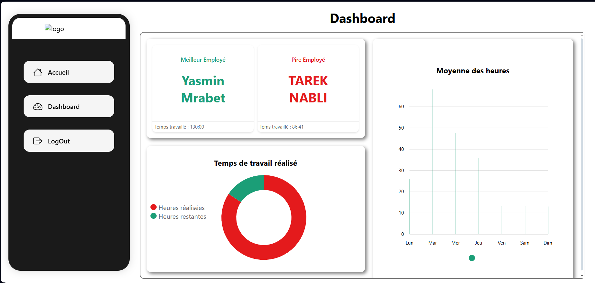
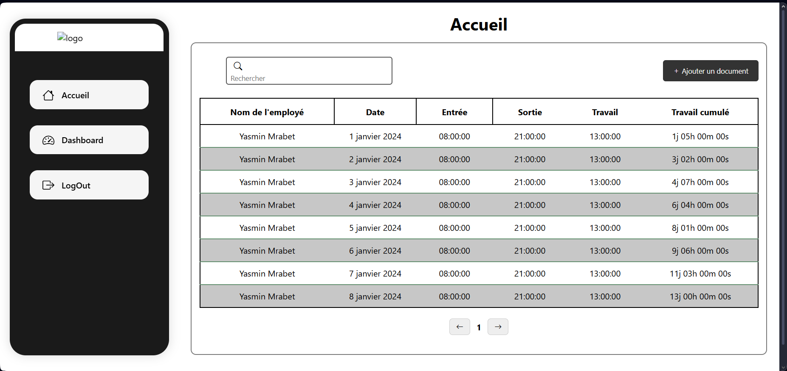

# DataPulse

This project is a **full-stack employee attendance tracking system** with a **Django REST API backend** and an **Angular frontend**.  
It allows HR/admins to **upload attendance data from Excel files**, compute **working hours**, and visualize **KPI reports** (best employee, worst employee, weekly trends, realized/remaining hours, etc.) on a modern dashboard.

---

## 🎥 Demo Video


---

## 🚀 Features

- 📂 **Excel Import**: Upload `.xls` or `.xlsx` files containing attendance records.  
- ⏱ **Automatic Time Calculation**: Computes daily working hours, cumulative hours, and detects absences.  
- 📊 **Dashboard KPIs**:
  - Best & Worst Employee
  - Total & Average Hours
  - Weekly Trends (Mon → Sun)
  - Realized vs Remaining Hours
- 👩‍💼 **Employee View**: List of employees with their daily check-in/check-out and cumulative hours.  
- 🌐 **REST API** powered by Django REST Framework  
- 🎨 **Angular Frontend**:
  - Modern responsive UI
  - Sidebar navigation (Home, Dashboard, Logout)
  - Charts (bar & donut)

---

## 🖥 Frontend Preview

### Dashboard


### Employee Records


---

## ⚙️ Tech Stack

- **Backend**: Django 5 + Django REST Framework  
- **Frontend**: Angular + Chart libraries  
- **Database**: SQLite (dev) / PostgreSQL (prod)  
- **Libraries**: Pandas, Openpyxl, XLRD (for Excel parsing)

---

## 📦 Installation

### Backend (Django API)

```bash
# Clone repo
git clone https://github.com/yourusername/employee-dashboard.git
cd employee-dashboard/backend

# Create virtual environment
python -m venv venv
source venv/bin/activate  # Windows: venv\Scripts\activate

# Install dependencies
pip install -r requirements.txt

# Run migrations
python manage.py migrate

# Start backend
python manage.py runserver
